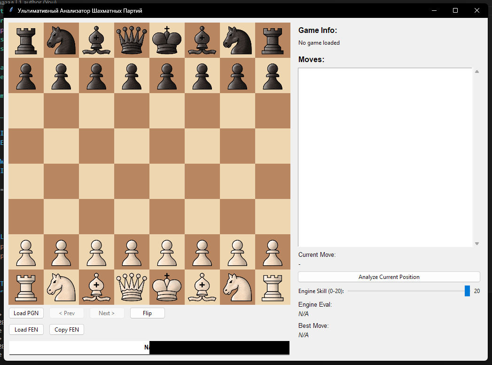
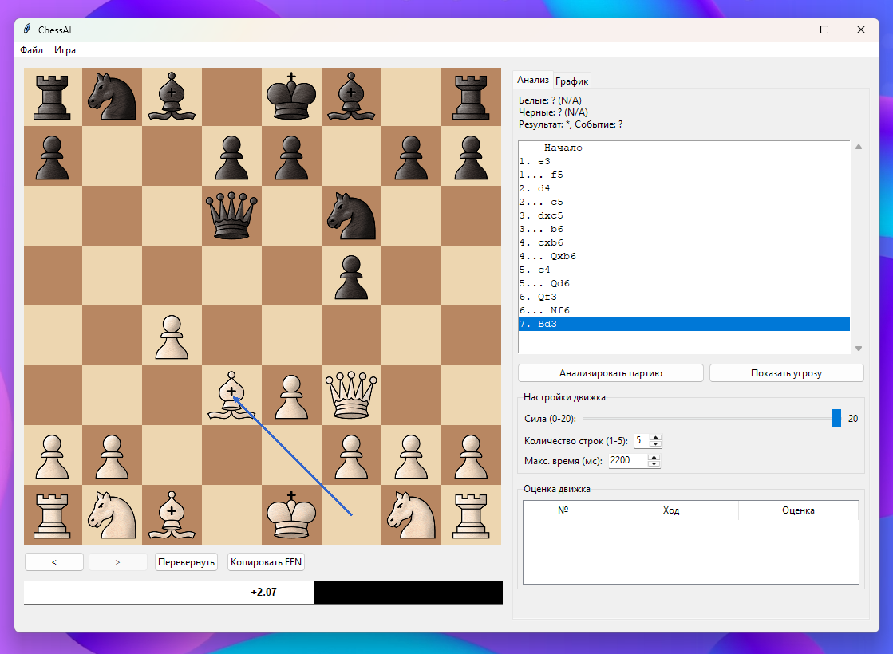
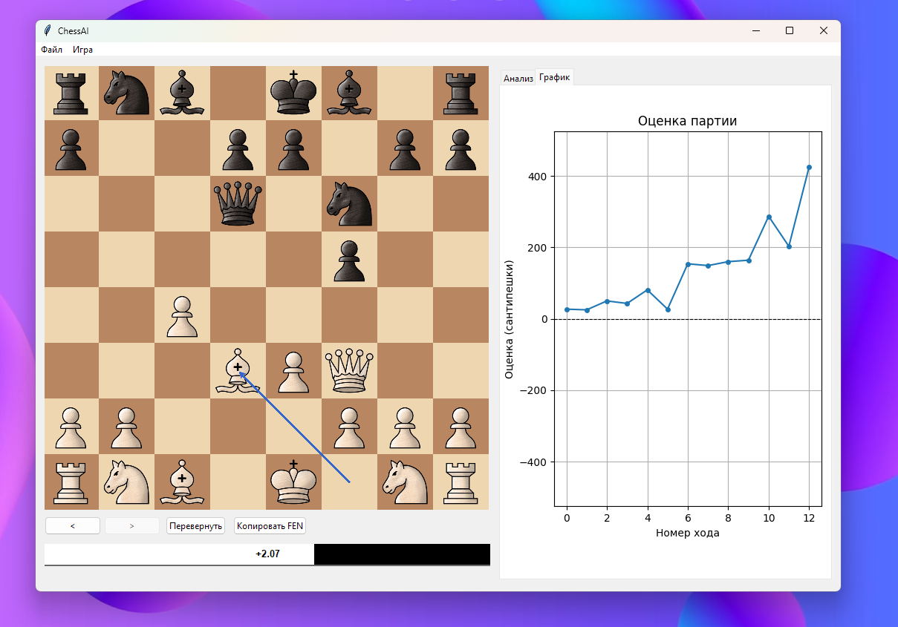

# ChessAI: Шахматный Анализатор

ChessAI — это инструмент для анализа шахматных партий, использующий движок Stockfish и графический интерфейс на Python. Он позволяет загружать партии в формате PGN, анализировать ходы и получать рекомендации по улучшению игры.


## Скриншоты





## Основные возможности

*   **Загрузка партий**:
    *   Из файлов формата PGN, в том числе с несколькими партиями.
    *   По URL с популярного шахматного сервера Lichess.org.
    *   Установка любой позиции из нотации FEN.
*   **Анализ в реальном времени**:
    *   Мгновенная оценка текущей позиции с помощью движка Stockfish.
    *   Отображение нескольких лучших линий (Multi-PV).
    *   Визуализация лучших ходов и угроз прямо на доске.
*   **Интерактивная доска**:
    *   Полная навигация по ходам партии (вперед, назад, к началу, в конец).
    *   Анимированное перемещение фигур для наглядности.
    *   Возможность перевернуть доску в любой момент.
*   **Глубокий анализ партии**:
    *   Автоматический полный анализ сыгранной партии с классификацией ходов (зевок, ошибка, неточность).
    *   Построение графика оценки, который наглядно показывает переломные моменты в игре.
*   **Аннотации и сохранение**:
    *   Добавление комментариев и стандартных NAG-ов (!, ?, !!, ?? и т.д.) к ходам.
    *   Сохранение проанализированной партии со всеми аннотациями обратно в PGN-файл.
*   **Игра против движка**:
    *   Возможность сыграть партию против Stockfish с настраиваемым уровнем силы.
*   **Удобство использования**:
    *   Копирование FEN-позиции в буфер обмена.
    *   Звуковое сопровождение ходов.
    *   Интуитивно понятный интерфейс с вкладками для анализа и графика.

## Установка и запуск

Для работы приложения необходимо выполнить следующие шаги:

### 1. Клонирование репозитория

```bash
git clone https://github.com/SynvexAI/ChessAI
cd ChessAI
```

### 2. Установка зависимостей

Приложение требует наличия Python 3 и нескольких библиотек. Установите их с помощью `pip`:

```bash
pip install -r requirements.txt
```

### 3. Структура папок

Убедитесь, что папка `assets` со всеми ресурсами (изображения, звуки) находится в корне проекта. Структура должна выглядеть так:

```
.
├── assets/
│   ├── images/
│   │   ├── board.png
│   │   └── pieces/
│   │       ├── black/
│   │       └── white/
│   └── sounds/
│       ├── move.wav
│       └── capture.wav
├── main.py
├── engine_handler.py
├── stockfish.exe (или stockfish)
└── README.md
```

### 4. Запуск приложения

После выполнения всех шагов запустите главный файл:

```bash
python main.py
```

## Как пользоваться

*   **Загрузка партии**: Используйте меню "Файл" для загрузки PGN, FEN или по URL.
*   **Навигация**: Используйте кнопки `<` и `>` под доской или кликайте по списку ходов справа.
*   **Анализ**: Нажмите "Анализировать партию" для полного разбора или просто перемещайтесь по ходам для анализа "на лету".
*   **Игра с движком**: Выберите "Игра" -> "Новая игра с движком", чтобы начать партию против компьютера.
*   **Настройки движка**: На вкладке "Анализ" можно изменить силу игры и количество анализируемых линий.

## Файлы проекта

*   `main.py`: Основной файл приложения. Содержит класс `ChessAnalyzerApp`, который управляет графическим интерфейсом (GUI), логикой отображения доски, взаимодействием с пользователем и обработкой PGN.
*   `engine_handler.py`: Модуль для взаимодействия с шахматным движком Stockfish. Класс `EngineHandler` отвечает за запуск процесса движка, отправку команд по протоколу UCI и парсинг его вывода.

## 📄 Лицензия

Этот проект распространяется под лицензией MIT. Подробнее см. в файле LICENSE. 
